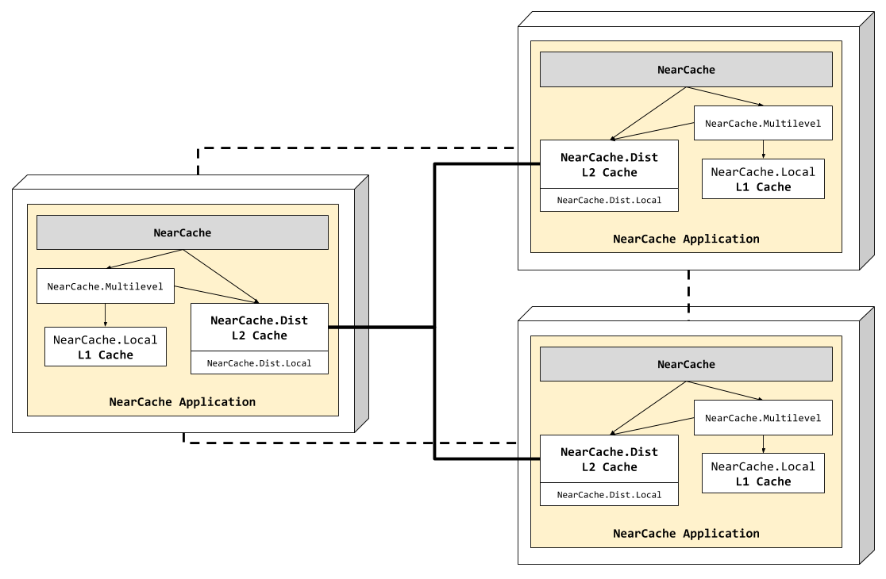

# NearCache

This example shows how to setup a [near cache](https://es.slideshare.net/C0deKhan/distributed-caching-essential-lessons-ts-1402)
topology.

A Near Cache provides local cache access to recently and/or often-used data,
backed by a centralized or multi-tiered cache that is used to load-on-demand
for local cache misses. The result is a tunable balance between the preservation
of local memory resources and the performance benefits of truly local caches.

In this example, the near cache is composed by two caching levels:
 - L1 – Local cache (nearest): [NearCache.Local](lib/near_cache/local.ex)
 - L2 – Distributed cache: [NearCache.Dist](lib/near_cache/dist.ex)

Besides, we have a multi-level cache module [NearCache.Multilevel](lib/near_cache/multilevel.ex)
in order to encapsulate these two cache levels mentioned before.

And finally, the main interface, our near cache module [NearCache](lib/near_cache.ex),
which is basically a wrapper on top of the multi-level and distributed cache.
The purpose of this module is to abstract the access to the multi-level and
distributed cache, for example, the `get` and `get!` calls should be forwarded
to `NearCache.Multilevel`, so the multi-level logic can be done. Multi-level
cache checks the fastest (L1 cache first), and if it hits, it proceeds at high
speed. If that first cache misses, the next fastest cache (L2 cache) is checked,
and so on. The rest of the calls in our example are forwarded to the distributed
cache `NearCache.Dist`.

This near cache also has a post hook to log all `get` and `get!` commands, others
are skipped. In this way, we'll able to see what cache level the data was
retrieved from.

## Near Cache View

In case you're wondering, this is how the near-cache would looks like:

<p align="center">
  
</p>

As shown in the figure, **Nebulex** distributed caches in nodes are connected
each other, this happens once the Elixir cluster is setup. Then, they work
automatically distributing the load across cluster nodes, and to do so, we
provide our own [NodePicker](lib/near_cache/node_picker.ex) implementation,
which uses [Jump Consistent Hash](https://arxiv.org/abs/1406.2294) algorithm.

## Getting started

First, let's do some tests locally, open an Elixir interactive console:

```
$ mix deps.get
$ iex -S mix
```

Now let's do some tests:

```elixir
# check there is nothing cached
iex(1)> NearCache.get "foo"

[debug] Elixir.NearCache.Local.get(1, [return: :object]) ==> nil
[debug] Elixir.NearCache.Dist.get(1, [return: :object]) ==> nil

# let's save some data
# data will be saved into the distributed cache – level 2 (L2)
iex(2)> NearCache.set "foo", "bar"
"bar"

# let's try to retrieve the data again
iex(3)> NearCache.get! "foo"

[debug] Elixir.NearCache.Local.get("foo", [return: :object]) ==> nil
[debug] Elixir.NearCache.Dist.get("foo", [return: :object]) ==> %Nebulex.Object{key: "foo", ttl: :infinity, value: "bar", version: 1501365069361212000}
"bar"
```

As you can see, the data was found within the L2 cache (distributed cache) as we
expected. Now, let's retrieve the data again:

```elixir
iex(4)> NearCache.get! "foo"
"bar"

[debug] Elixir.NearCache.Local.get("foo", [return: :object]) ==> %Nebulex.Object{key: "foo", ttl: :infinity, value: "bar", version: 1501369202402508000}
```

The data has been retrieved from the nearest cache, the L1 cache – the multi-level
cache did its work!

## Distributed tests

We are going to create a three nodes cluster, so let's open three Elixir consoles,
Node 1:

```
iex --name node1@127.0.0.1 --cookie near_cache -S mix
```

Node 2:

```
iex --name node2@127.0.0.1 --cookie near_cache -S mix
```

Node 3:

```
iex --name node3@127.0.0.1 --cookie near_cache -S mix
```

Next step would be setup the cluster, but fortunately this was already done,
if you take a look to [NearCache.Application](lib/near_cache/application.ex),
there is a routine at the beginning of the start function `setup_cluster()`,
which setup the cluster for us, it is very simple, it reads from config a list
of nodes and then ping them – pretty easy right? as it should be!

Now that we have the cluster ready to be used by our near cache, let's
try it out, save some data on node 1:

```elixir
iex(node1@127.0.0.1)> NearCache.set "foo", "bar"
"bar"
```

Retrieve that saved data from other node, for example from node2:

```elixir
iex(node2@127.0.0.1)> NearCache.get "foo"
"bar"

[debug] Elixir.NearCache.Local.get("foo", [return: :object]) ==> nil
[debug] Elixir.NearCache.Dist.get("foo", [return: :object]) ==> %Nebulex.Object{key: "foo", ttl: :infinity, value: "bar", version: 1501368687029316000}
```

And from node 3:

```elixir
iex(node3@127.0.0.1)> NearCache.get "foo"
"bar"

[debug] Elixir.NearCache.Local.get("foo", [return: :object]) ==> nil
[debug] Elixir.NearCache.Dist.get("foo", [return: :object]) ==> %Nebulex.Object{key: "foo", ttl: :infinity, value: "bar", version: 1501368751793454000}
```

Seems to be working as expected, as you can see the data was retrieved from L2
cache (distributed cache) at first time, now let's get the same data again:

```elixir
iex(node2@127.0.0.1)> NearCache.get "foo"

[debug] Elixir.NearCache.Local.get("foo", [return: :object]) ==> %Nebulex.Object{key: "foo", ttl: :infinity, value: "bar", version: 1501368751802015000}
"bar"
```

This time the data was retrieved from L1 cache, it is now in the nearest cache,
the multi-level cache did its work again!
