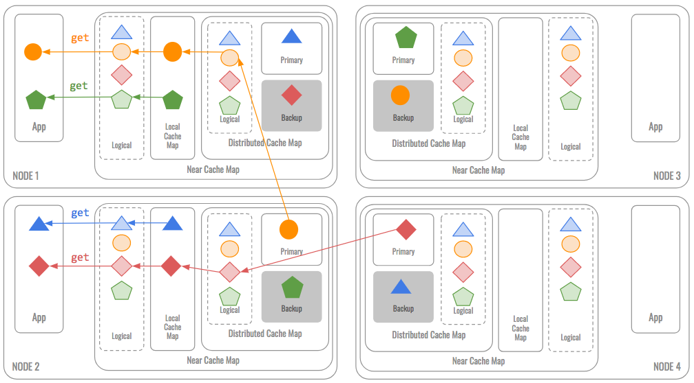
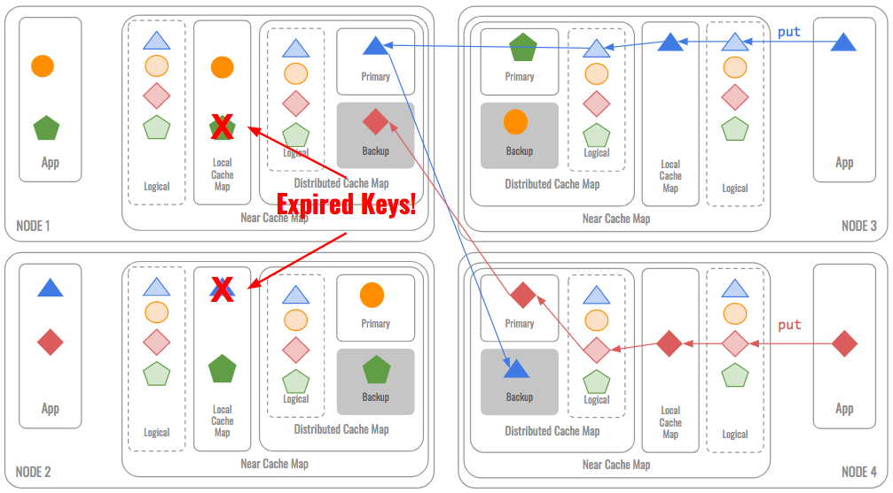
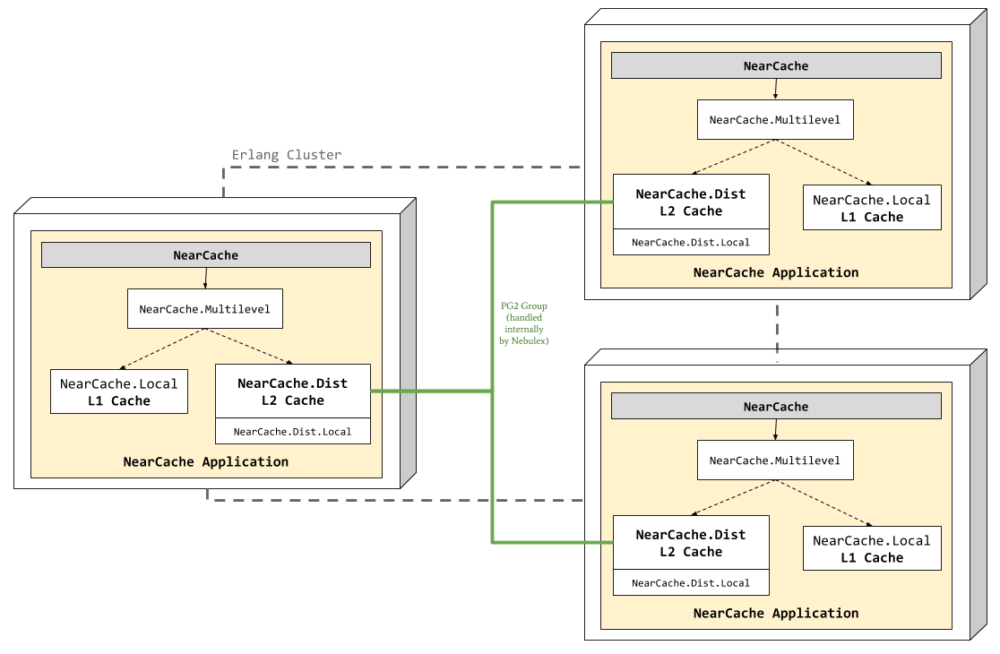

# NearCache

This example shows how to setup a near cache topology using Nebulex.

## Near Cache Topology

* **Requirement**: Extreme Performance. Extreme Scalability.

* **Solution**: Local “L1” In-Memory Cache in front of a Clustered “L2”
  Partitioned Cache.

* **Result**: Zero Latency Access to recently-used and frequently-used data.
  Scalable cache capacity and throughput, with a fixed cost for worst-case.
  A Near Cache provides local cache access to recently and/or often-used data,
  backed by a centralized or multi-tiered cache that is used to load-on-demand
  for local cache misses. The result is a tunable balance between the
  preservation of local memory resources and the performance benefits
  of truly local caches.

### Near Cache Topology – Reads

Multi-level caches generally operate by checking the fastest, level 1 (L1) cache
first (local cache), if it hits, the adapter proceeds at high speed. If that
first cache misses, the next fastest cache (L2, maybe distributed cache) is
checked, and so on, before accessing external storage, maybe the Database. The
The Database may serve also as backup, in the case the data in the cache becomes
unavailable; recovered from DB on-demand.

<p align="center">
  
</p>

### Near Cache Topology – Writes

For write functions, the "Write Through" policy is applied by default, this
policy ensures that the data is stored safely as it is written throughout the
hierarchy; it might be possible to force the write operation in a specific
level (this depends on the cache options).

<p align="center">
  
</p>

### Failover

Failover has to be implemented on top of Nebulex. For instance, data can be
explicitly backed up in a Database, hence when a cache node is unavailable and
we get a cache miss, data can be recovered from Database; it is an on-demand
process, it is only executed on cache misses (Database is the fallback or
level 3 – L3). Therefore, there is never a moment when the cluster is not ready
for any server to die: no data vulnerabilities.

For more info you can check:
 * [Nebulex.Adapters.Multilevel](https://github.com/cabol/nebulex/blob/master/lib/nebulex/adapters/multilevel.ex)
 * [nebulex_ecto](https://github.com/cabol/nebulex_ecto)

### References

* [Distributed Caching Essential Lessons by Cameron Purdy](https://www.infoq.com/presentations/distributed-caching-lessons)

## Near Cache with Nebulex

In this example, the near cache is composed by two caching levels:
 - L1 - Local cache (nearest): `NearCache.L1`.
 - L2 - partitioned cache: `NearCache.L2`.

The multi-level cache is defined in the module [NearCache](lib/near_cache.ex),
which is basically a wrapper on top of the multi-level and partitioned cache.
The purpose of this module is to abstract the access to the multi-level and
partitioned cache, for example, the `get` and `get!` calls should be forwarded
to `NearCache.Multilevel`, so the multi-level logic can be done. Multi-level
cache checks the fastest (L1 cache first), and if it hits, it proceeds at high
speed. If that first cache misses, the next fastest cache (L2 cache) is checked,
and so on. The rest of the calls in our example are forwarded to the partitioned
cache `NearCache.L2`.

This near cache also has a post hook to log all `get` and `get!` commands, others
are skipped. In this way, we'll able to see what cache level the data was
retrieved from.

In case you're wondering, this is how the near-cache would looks like:

<p align="center">
  
</p>

As shown in the figure, **Nebulex** distributed caches in nodes are connected
each other, this happens once the Elixir cluster is setup. Then, they work
automatically distributing the load across cluster nodes, and to do so, we
provide our own [HashSlot](lib/near_cache/jumping_hash_slot.ex) implementation,
which uses [Jump Consistent Hash](https://arxiv.org/abs/1406.2294) algorithm.

## Getting started

First, let's do some tests locally, open an Elixir interactive console:

```
$ mix deps.get
$ iex -S mix
```

Now let's do some tests:

```elixir
# check there is nothing cached yet
iex(1)> NearCache.get "foo"
[debug] Elixir.NearCache.L1.get("foo", []) ==> nil
[debug] Elixir.NearCache.L2.get("foo", []) ==> nil
nil

# let's save some data
# data will be saved into the distributed cache – level 2 (L2)
iex(2)> NearCache.L2.set "foo", "bar"
"bar"

# let's try to retrieve the data again
iex(3)> NearCache.get "foo"
[debug] Elixir.NearCache.L1.get("foo", []) ==> nil
[debug] Elixir.NearCache.L2.get("foo", []) ==> "bar"
"bar"
```

As you can see, the data was found into the L2 cache (distributed cache), as we
expected. Now, let's retrieve the data again:

```elixir
iex(4)> NearCache.get! "foo"
[debug] Elixir.NearCache.L1.get("foo", []) ==> "bar"
[debug] Elixir.NearCache.L2.get("foo", []) ==> "bar"
"bar"
```

The data has been retrieved from the nearest cache, L1 in this case. The
multi-level cache did the work!

## Distributed environment

We are going to create a three nodes cluster, so let's open three Elixir
consoles, Node 1:

```
iex --name node1@127.0.0.1 --cookie near_cache -S mix
```

Node 2:

```
iex --name node2@127.0.0.1 --cookie near_cache -S mix
```

Node 3:

```
iex --name node3@127.0.0.1 --cookie near_cache -S mix
```

Next step would be setup the cluster, but fortunately this was already done,
if you take a look to [NearCache.Application](lib/near_cache/application.ex),
there is a routine at the beginning of the start function `setup_cluster()`,
which setup the cluster for us, it is very simple, it reads from config a list
of nodes and then ping them – pretty easy right? as it should be!

Now that we have the cluster ready to be used by our near cache, let's
try it out, save some data on node 1:

```elixir
iex(node1@127.0.0.1)> NearCache.set "foo", "bar"
"bar"
```

Retrieve that saved data from other node, for example from node2:

```elixir
iex(node2@127.0.0.1)> NearCache.get "foo"
[debug] Elixir.NearCache.L1.get("foo", []) ==> nil
[debug] Elixir.NearCache.L2.get("foo", []) ==> "bar"
"bar"
```

And from node 3:

```elixir
iex(node3@127.0.0.1)> NearCache.get "foo"
[debug] Elixir.NearCache.L1.get("foo", []) ==> nil
[debug] Elixir.NearCache.L2.get("foo", []) ==> "bar"
"bar"
```

Seems to be working as expected, as you can see the data was retrieved from L2
cache (distributed cache) at first time, now let's do it again:

```elixir
iex(node2@127.0.0.1)> NearCache.get "foo"
[debug] Elixir.NearCache.L1.get("foo", []) ==> "bar"
[debug] Elixir.NearCache.L2.get("foo", []) ==> "bar"
"bar"
```

This time the data was retrieved from L1 cache, it is now in the nearest cache,
the multi-level cache did the work again!
