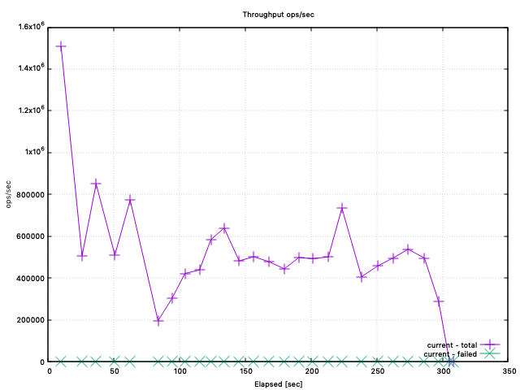
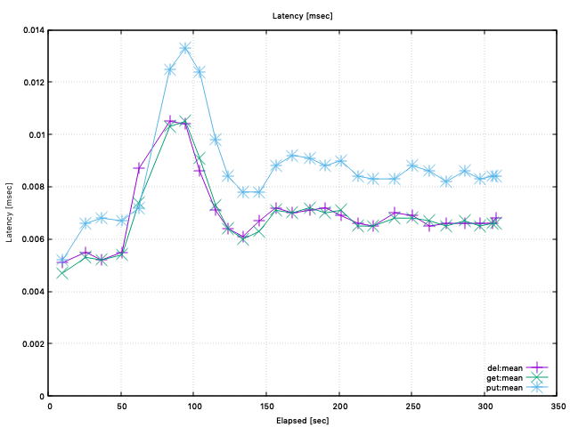

# NebulexBench

This project shows how to run bench/load tests against `Nebulex` using
[basho_bench tool](https://github.com/mrallen1/basho_bench).

## Getting started

First of all, let's run:

```
$ mix deps.get
$ iex -S mix
```

Then, to start the load tests we should execute the next functions:

```elixir
:basho_bench.start()

:basho_bench.setup_benchmark([])

:basho_bench.run_benchmark(['./bench/local_cache_bench.config'])
```

Once the bench starts you should see something like:

```
23:05:15.277 [info] Starting max worker: <0.295.0> on nonode@nohost
23:05:15.277 [info] Starting max worker: <0.293.0> on nonode@nohost
23:05:15.278 [info] Starting max worker: <0.291.0> on nonode@nohost
23:05:15.278 [info] Starting max worker: <0.289.0> on nonode@nohost
23:05:15.278 [info] Starting max worker: <0.287.0> on nonode@nohost
23:05:15.278 [info] Starting max worker: <0.285.0> on nonode@nohost
23:05:15.278 [info] Starting max worker: <0.283.0> on nonode@nohost
23:05:15.278 [info] Starting max worker: <0.281.0> on nonode@nohost
23:05:15.278 [info] Starting with duration: 5
:ok
```

Once the bench finishes:

```
23:10:22.458 [info] No Errors.
23:10:22.513 [info] module=basho_bench_stats_writer_csv event=stop stats_sink=csv
```

And finally, you can find the test results within the folder [tests](./tests).

To plot the results, you need to install `gnuplot`, and then run for throughput:

```
$ ./deps/basho_bench/priv/gp_throughput.sh -d "tests/current"
```

<p align="center">
  
</p>

And for latencies:

```
$ ./deps/basho_bench/priv/gp_latencies.sh -d "tests/current" -k "mean"
```

<p align="center">
  
</p>

### Test Environment:

 * Operating System: macOS High Sierra
 * CPU Information: Intel(R) Core(TM) i7-6700HQ CPU @ 2.60GHz
 * Number of Available Cores: 8
 * Available memory: 16 GB
 * Elixir 1.7.2
 * Erlang 21.0
