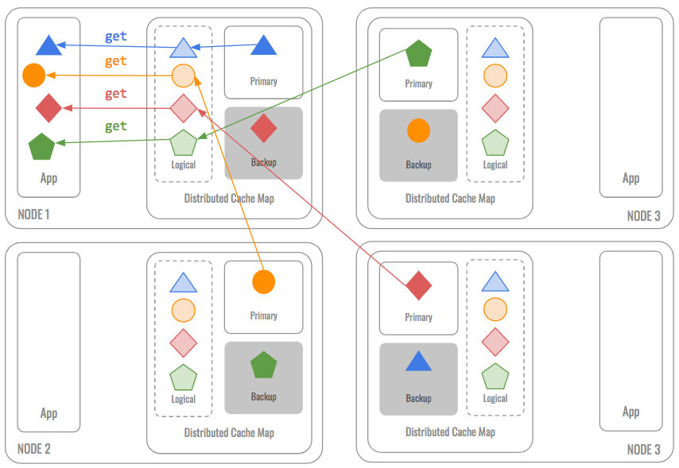
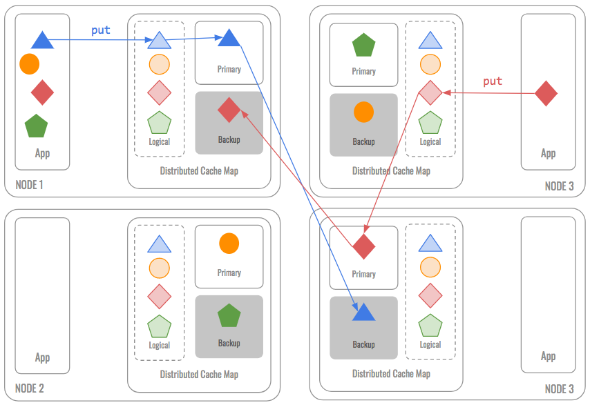
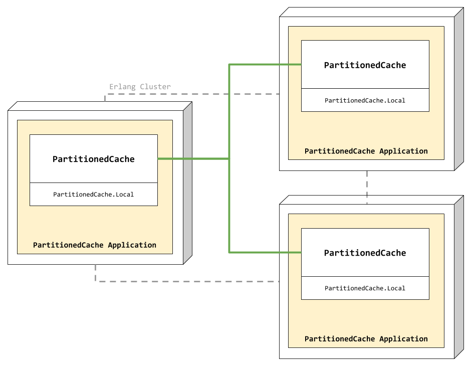

# Partitioned Cache

This example shows how to setup a partitioned cache topology using Nebulex.

## Partitioned Cache Topology

* **Requirement**: Extreme Scalability.

* **Solution**: Shaded-Nothing Architecture. Automatically Partition data across
  all cluster members.

* **Result**: Linear Scalability. By partitioning the data evenly, the per-port
  throughput (the maximum amount of work that can be performed by each server)
  remains constant as servers are added, up to the extent of the switched
  fabric.

### Benefits

* Partitioned - The size of the cache and the processing power available grow
  linearly with the size of the cluster.

* Load-Balanced - The responsibility for managing the data is automatically
  load-balanced across the cluster.

* Ownership - Exactly one node in the cluster is responsible for each piece of
  data in the cache.

* Supports cache-through architectures

* Supports data-grid capabilities

* Point-To-Point - The communication for the partitioned cache is all
  point-to-point, enabling linear scalability.

### Reads

<p align="center">
  
</p>

### Writes

<p align="center">
  
</p>

### Failover

Failover has to be implemented on top of Nebulex. For instance, data can be
explicitly backed up in a Database, hence when a cache node is unavailable and
we get a cache miss, data can be recovered from Database; it is an on-demand
process, it is only executed on cache misses (Database is the fallback).
Therefore, there is never a moment when the cluster is not ready for any server
to die: no data vulnerabilities.

For more info you can check:
 * [Nebulex.Adapters.Multilevel](https://github.com/cabol/nebulex/blob/master/lib/nebulex/adapters/multilevel.ex)
 * [nebulex_ecto](https://github.com/cabol/nebulex_ecto)

### References

* [Distributed Caching Essential Lessons by Cameron Purdy](https://www.infoq.com/presentations/distributed-caching-lessons)

## Partitioned Cache with Nebulex

In case you're wondering, this is how the partitioned cache would looks like:

<p align="center">
  
</p>

As shown in the figure, **Nebulex** distributed caches in nodes are connected
each other, this happens once the Elixir cluster is setup. Then, **Nebulex**
distribute the load across cluster nodes automatically, and to do so, we
provide our own [NodePicker](lib/near_cache/node_picker.ex) implementation,
which uses [Jump Consistent Hash](https://arxiv.org/abs/1406.2294) algorithm.

## Getting started

First of all let's run:

```
$ mix deps.get
```

We are going to create a three nodes cluster, so let's open three Elixir consoles,
Node 1:

```
iex --name node1@127.0.0.1 --cookie partitioned_cache -S mix
```

Node 2:

```
iex --name node2@127.0.0.1 --cookie partitioned_cache -S mix
```

Node 3:

```
iex --name node3@127.0.0.1 --cookie partitioned_cache -S mix
```

Next step would be setup the cluster, but fortunately this was already done,
if you take a look to [PartitionedCache.Application](lib/partitioned_cache/application.ex),
there is a routine at the beginning of the start function `setup_cluster()`,
which setup the cluster for us, it is very simple, it reads from config a list
of nodes and then ping them – pretty easy right? as it should be!

Now that we have the cluster ready to be used by our cache, let's try it out!

For example, from node 1 let's save some data:

```elixir
iex(node1@127.0.0.1)> PartitionedCache.set "foo", "bar"
"bar"
```

Retrieve that saved data from other node, for example from node2:

```elixir
iex(node2@127.0.0.1)> PartitionedCache.get "foo"
"bar"
```

And from node 3:

```elixir
iex(node3@127.0.0.1)> PartitionedCache.get "foo"
"bar"
```

You can continue playing with `PartitionedCache`, try other operations,
all the magic is done by `Nebulex` behind scenes.
