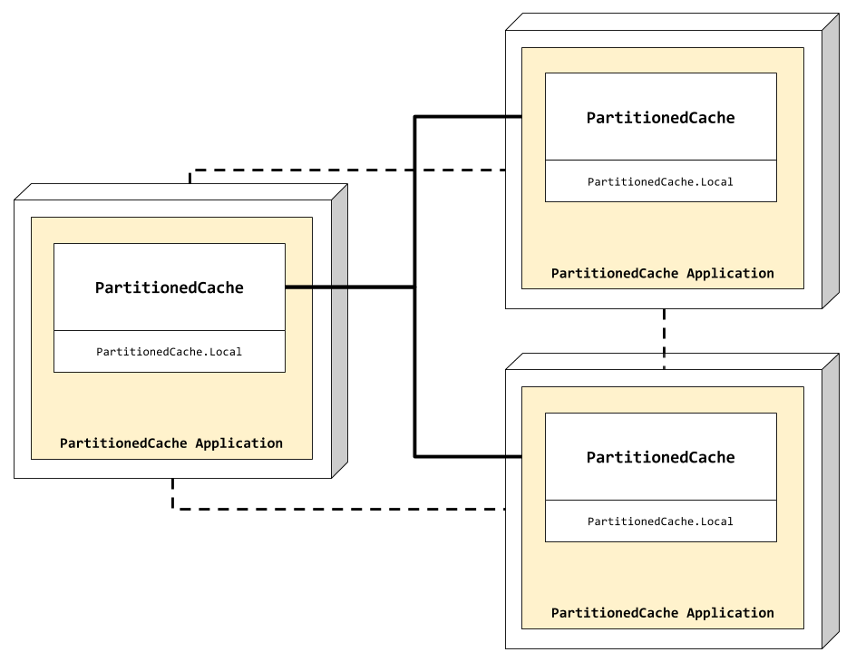

# Partitioned Cache

This example shows how to setup a [partitioned cache](https://es.slideshare.net/C0deKhan/distributed-caching-essential-lessons-ts-1402)
topology.

## Partitioned Cache View

In case you're wondering, this is how the partitioned cache would looks like:

<p align="center">
  
</p>

As shown in the figure, **Nebulex** distributed caches in nodes are connected
each other, this happens once the Elixir cluster is setup. Then, **Nebulex**
distribute the load across cluster nodes automatically, and to do so, we
provide our own [NodePicker](lib/near_cache/node_picker.ex) implementation,
which uses [Jump Consistent Hash](https://arxiv.org/abs/1406.2294) algorithm.

## Getting started

First of all let's run:

```
$ mix deps.get
```

We are going to create a three nodes cluster, so let's open three Elixir consoles,
Node 1:

```
iex --name node1@127.0.0.1 --cookie partitioned_cache -S mix
```

Node 2:

```
iex --name node2@127.0.0.1 --cookie partitioned_cache -S mix
```

Node 3:

```
iex --name node3@127.0.0.1 --cookie partitioned_cache -S mix
```

Next step would be setup the cluster, but fortunately this was already done,
if you take a look to [PartitionedCache.Application](lib/partitioned_cache/application.ex),
there is a routine at the beginning of the start function `setup_cluster()`,
which setup the cluster for us, it is very simple, it reads from config a list
of nodes and then ping them – pretty easy right? as it should be!

Now that we have the cluster ready to be used by our cache, let's try it out!

For example, from node 1 let's save some data:

```elixir
iex(node1@127.0.0.1)> PartitionedCache.set "foo", "bar"
"bar"
```

Retrieve that saved data from other node, for example from node2:

```elixir
iex(node2@127.0.0.1)> PartitionedCache.get "foo"
"bar"
```

And from node 3:

```elixir
iex(node3@127.0.0.1)> PartitionedCache.get "foo"
"bar"
```

You can continue playing with `PartitionedCache`, try other operations,
all the magic is done by `Nebulex` behind scenes.
